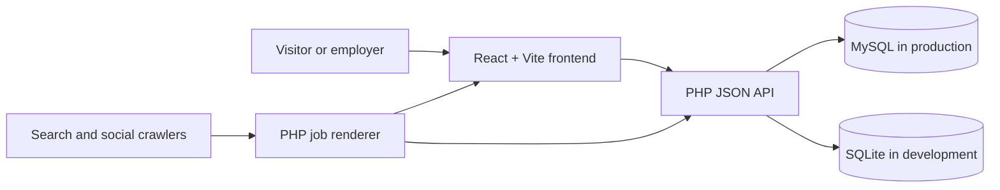

# Wogopogo

[](https://github.com/crypto-frog/wogopogo/actions/workflows/ci.yml)
[](https://crypto-frog.github.io/wogopogo/)
[](https://wogopogo.ca/)
[](LICENSE)

Wogopogo is a free, account-free community job board for British Columbia's Okanagan Valley, from Osoyoos to Salmon Arm. It combines a responsive React interface with a compact PHP API that runs on conventional shared hosting.

**[Explore the project](https://crypto-frog.github.io/wogopogo/)** · **[Visit the live board](https://wogopogo.ca/)** · **[Contribute](CONTRIBUTING.md)**

## What the project provides

- Search, category, location, and employment-type filtering
- Account-free job submission with one-time management tokens
- A moderation queue with approve, reject, feature, renew, close, and delete actions
- A private JSON operations CLI for audited, idempotent management over SSH
- Source provenance and verification state for carefully aggregated public listings
- Per-IP rate limits and a honeypot submission field
- Dark and light appearances with restrained colour accents
- A tint-aware, lazy-loaded Lake Dash microgame with local-only scores
- Keyboard-accessible controls, visible focus states, and responsive layouts
- Server-rendered public job pages with canonical metadata and JobPosting JSON-LD
- A database-driven XML sitemap and deliberate crawler directives
- SQLite for zero-setup local development and MySQL for production

Wogopogo is intentionally small. It is designed to be understandable, deployable, and maintainable without a large infrastructure stack.

## Architecture



The React application is built into static assets. The PHP API handles listings, moderation, validation, rate limiting, and database access. Public `/jobs/{id}/{job-title}` requests pass through a small PHP renderer so crawlers receive meaningful HTML and structured data before React hydrates the interface. The homepage is also rendered from the live database so every current job has a crawlable internal link before JavaScript runs.

This split is deliberate: Bluehost-style shared hosting supports PHP and MySQL reliably but does not provide a persistent Node.js application server.

See [ARCHITECTURE.md](ARCHITECTURE.md) for request flows and system boundaries, and [API.md](API.md) for the HTTP interface.

Production operators and AI agents should also read [AGENTS.md](AGENTS.md) and
[AI-OPERATIONS.md](AI-OPERATIONS.md). The operations CLI is installed outside
the public document root, loads server-only credentials in place, emits JSON,
defaults imports to a dry run, and records every mutation in an append-only audit trail.

## Repository map

```text
wogopogo/
├── frontend/                React application and contract tests
│   ├── public/              robots.txt, llms.txt, favicon
│   ├── src/                 pages, components, API client, styles
│   └── test/                dependency-free API contract tests
├── backend/
│   ├── api/                 PHP API, validation, persistence, configuration
│   ├── dev-server.php       local PHP router
│   └── schema.sql           reference MySQL schema
├── deploy/                  complete shared-hosting deployment package
├── ops/                     private SSH/AI operations CLI and import contract
├── docs/                    GitHub Pages project website
├── scripts/                 repository safety checks
└── .github/                 CI, Pages, issue, PR, and dependency automation
```

## Quick start: interface demo

Requires Node.js 22.13 or newer.

```bash
cd frontend
npm ci
npm run dev:mock
```

Open the local URL printed by Vite. The mock mode uses in-memory sample listings, makes no network requests, and stores no data. The mock moderator key is `demo`.

## Full-stack local development

Requires Node.js 22.13+ and PHP 8.2+.

Terminal one, from the repository root:

```bash
php -S 127.0.0.1:8000 backend/dev-server.php
```

Terminal two:

```bash
cd frontend
npm ci
npm run dev
```

Vite proxies `/api` to the local PHP server. SQLite tables and development data are created automatically. For a private local moderator key, create `backend/api/config.local.php`:

```php
<?php
$CONFIG['admin_key'] = 'use-a-long-local-development-key';
```

The override is ignored by Git.

## Tests and production build

```bash
cd frontend
npm test
npm run build
npm audit
```

From the repository root, verify that committed configuration remains publishable:

```bash
node scripts/check-public-config.mjs
```

GitHub Actions runs the same contract, build, PHP syntax, and public-configuration checks for every pull request.

## Configuration and deployment

The committed `backend/api/config.php` and `deploy/api/config.php` files are safe development templates. They contain no production credentials, and the moderator API remains disabled until an administrator replaces `change-me` on the server.

For a shared-hosting installation:

1. Read [INSTALL-BLUEHOST.md](INSTALL-BLUEHOST.md).
2. Create a MySQL database and a dedicated database user.
3. Configure the server-only `api/config.php`.
4. Upload the complete contents of `deploy/`, including both `.htaccess` files.
5. Never replace an existing live `api/config.php` during an upgrade.
6. Verify `/api/health`, `/sitemap.xml`, the homepage, and a public job route.

The `deploy/` directory is maintained for transparent, inspectable releases. Production credentials, database exports, logs, and local SQLite data must never be committed.

## Search and machine-readable discovery

Approved, unexpired listings are exposed through:

- Canonical, descriptive, server-rendered `/jobs/{id}/{job-title}` pages
- Valid JobPosting JSON-LD
- A dynamic `/sitemap.xml`
- Crawl directives in `robots.txt`
- Descriptive route metadata and social sharing tags
- An experimental `llms.txt` resource

These features support discovery and interpretation; they do not guarantee indexing, ranking, or inclusion in generated answers.

## Security model

Wogopogo uses prepared SQL statements, server-side validation, hashed management tokens, constant-time moderator-key comparison, request-size checks, same-origin production access, and rate limiting. New listings require moderation by default.

Please do not open public issues for suspected vulnerabilities. Follow [SECURITY.md](SECURITY.md) and use GitHub's private vulnerability reporting channel.

## Contributing

Contributions are welcome, including accessibility improvements, careful UX refinements, documentation, tests, translations, and narrowly scoped backend hardening.

Read [CONTRIBUTING.md](CONTRIBUTING.md), the [Code of Conduct](CODE_OF_CONDUCT.md), and the [roadmap](ROADMAP.md) before opening a pull request. Larger changes should begin with a discussion or feature proposal.

## Project status

Version 1.4 adds the agent-safe operations surface and source provenance model. The public repository is the community development home; deployments remain a separate maintainer-controlled process. Merging a contribution does not automatically publish it to the live service.

## Licence

Wogopogo is available under the [MIT License](LICENSE).
